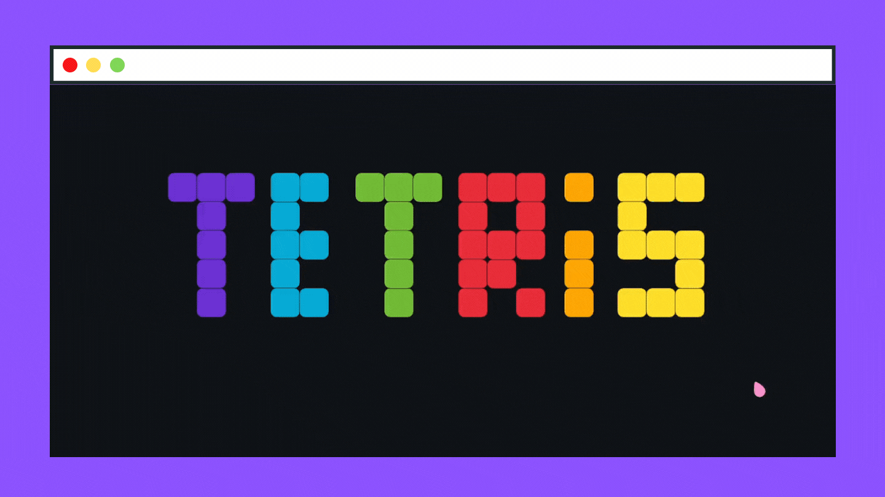
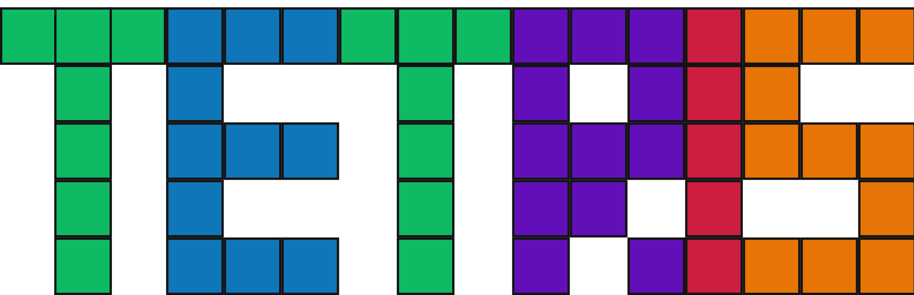

# Missão 1 de Linguagens de Programação

Este trabalho é uma implementação do jogo Tetris, utilizando HTML, CSS e JavaScript.

## Como jogar

### Comandos

Para acessar o jogo basta entrar neste [link](https://ahalic.github.io/Tetris/). Foi usado o GithubPages para fazer o deploy do jogo. Os comandos estão presentes no botão *options* dentro do jogo, sendo eles:

- Para descer a peça, pressionar a tecla de seta para baixo;
- Para mover a peça para a esquerda, pressionar a tecla de seta para esquerda;
- Para mover a peça para a direita, pressionar a tecla de seta para direita;
- Para rotacionar a peça, pressionar a tecla de seta para cima (a rotação é feita em sentido horário);
- Para queda brusca, pressionar a tecla shift.

No botão *options* ainda é possível silenciar o jogo.

### A pontuação
A pontuação consiste em completar linhas com peças. Completando mais de uma linha em uma única jogada a pontuação recebe bônus, este variando de acordo com a quantidade de linhas. Sendo:

 - 1 linha 10 pontos;
 - 2 linhas 30 pontos;
 - 3 linhas 60 pontos;
 - 4 linhas 100 pontos.

Os níveis do jogo variam de acordo com a pontuação do jogador, aumentando a velocidade com que a peça abaixa quanto maior a pontuação. Isso é feito seguindo os seguintes valores:

- Level 0 = pontuação menor que 100;
- Level 1 = pontuação menor que 300;
- Level 2 = pontuação menor que 500;
- Level 3 = pontuação menor que 800;
- Level 4 = pontuação menor que 1100;
- Level 5 = pontuação menor que 1400;
- Level 6 = pontuação menor que 1700;
- Level 7 = pontuação menor que 2000;
- Level 8 = pontuação maior ou igual a 2000.

    

<!--  -->

## Conteúdo do repositório

O repositório foi divido em 5 pastas. Aqui serão explicados os arquivos feitos em JavaScript, presentes na pasta src, e as classes principais usadas para o trabalho. 

### Block
Arquivo contendo a classe Block e seus métodos. Cada peça é formada por uma quantidade x de blocos, dependendo do formato. Para impresão do bloco foi usada uma imagem, esta é carregada na classe BlockImages (no arquivo loadImgs).

### Format 
Arquivo contendo as 7 classes Format, e seus métodos, sendo cada uma delas referente a um formato diferente de peça.

### Piece
Arquivo contendo a classe Piece e seus métodos. Essa classe representa cada peça usada no jogo, e cada uma contém um formato.

### Game
Arquivo contendo a classe Game e seus métodos. Nesta classe são guardadas as principais informações do jogo, como pontuação, linhas e level. Além disso, é nela que fica guardada a matriz de representação de jogo, sendo essa uma matriz 18x10. 
Também é nessa classe que é guardado o método de sort do jogo, para isso foi usado o algoritmo de sort chamado *The 7-bag*.

### Run
É nesse arquivo que o jogo acontece. São criadas as classes usadas, os eventos importantes e é montado todo o jogo. Também é nesse arquivo em que se localiza o loop principal do jogo.

## Refs
- [Algoritmo de sort](https://simon.lc/the-history-of-tetris-randomizers)
- [JsDoc](https://jsdoc.app/howto-es2015-classes.html)
- [Fonte dos textos](https://www.dafont.com/pt/press-start-2p.font)

**Autores**: Sophie Dilhon, Fernando Azevedo & Igor Varejão

    

